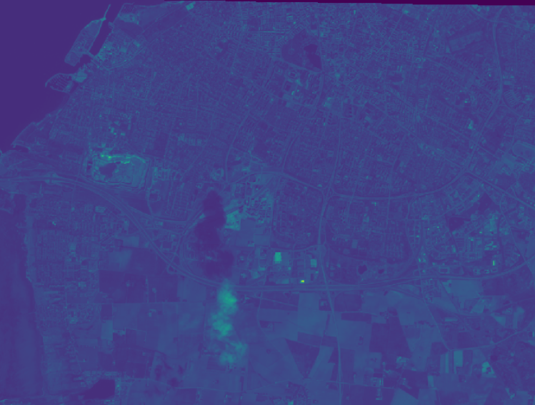

# Satellite Image Analysis and Kmeans Clustering 

## A. Problem adressed

The term clustering is used to refer to the act of grouping information, which can be data from customers, products or in this example satellite data.It is the way to group and categorize based on common characteristics. Once we have identified the clusters we can make customized decisions for each of the clusters. 
Think of a puzzle, the fastest way to begin is to separate the pieces by color, shape, and edges.

## B. Methodology and Implementation

### Methodology 
   k-means clustering is a method of vector quantization, originally from signal processing, that aims to partition n observations into k clusters in which each observation belongs to the cluster with the nearest mean (cluster centers or cluster centroid), serving as a prototype of the cluster.

 
### Preprocessing 
   Working on satellite image data implies being able to :
   * opening satellite data formats like .tiff
   * reading one or multiple hyperspectral bands
   * visualize the satellite image
   * clipping the image to boundary of interest
   * Derive statitics on grid 
   * Clipping Images to Boundaries
   * Create Vegetation Index (NDVI)
  All these tasks are explained in the code attached to this repo for the following main satellite data
   
   

### Clustering Algorithm implementation
  
  This example is based on satellite data with NDVI (normalized difference vegetation index). NDVI is an indicator of vegetation health based on how plants reflect certain ranges of the electromagnetic spectrum. The index ranges from -1 to 1; 1 indicating the best health status of the observed land cover.
  

  The core concept is to identify k clusters based on the NDVI without having to learn an underlying image to ndvi index mapping. 
  
## C. Results
The clustering model generates the following map with the inputed amount of clusters.

  

